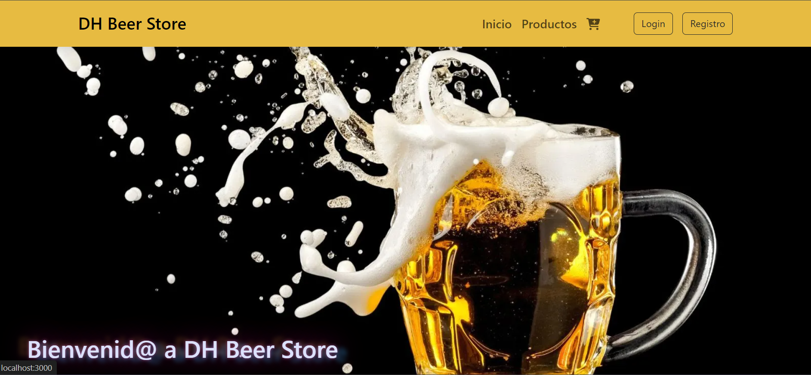
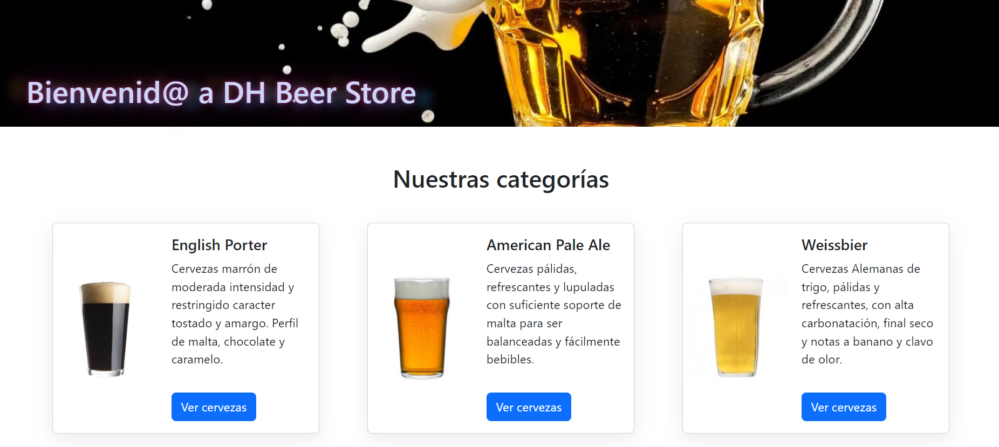
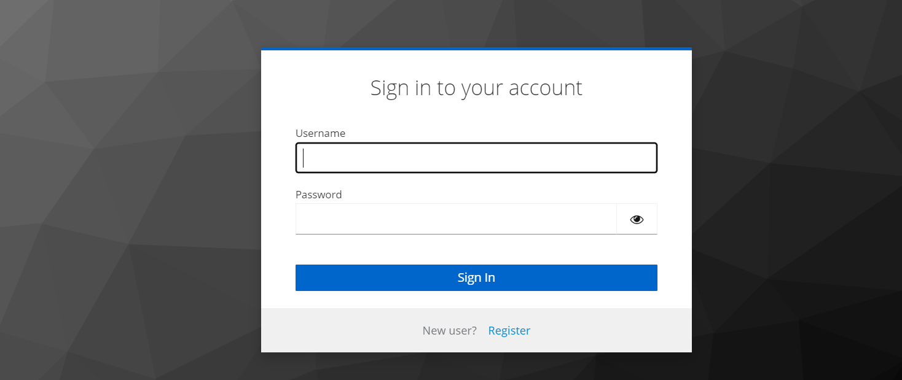
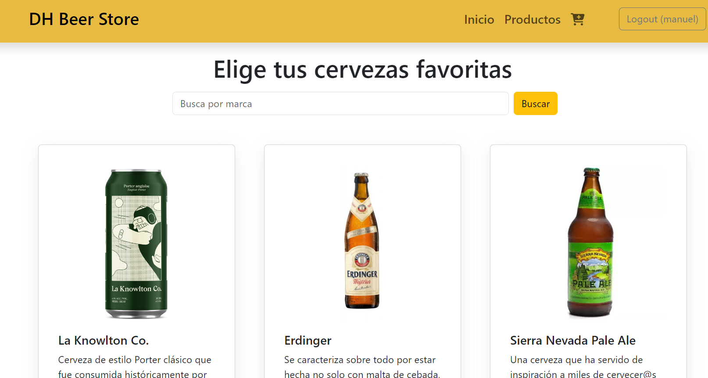
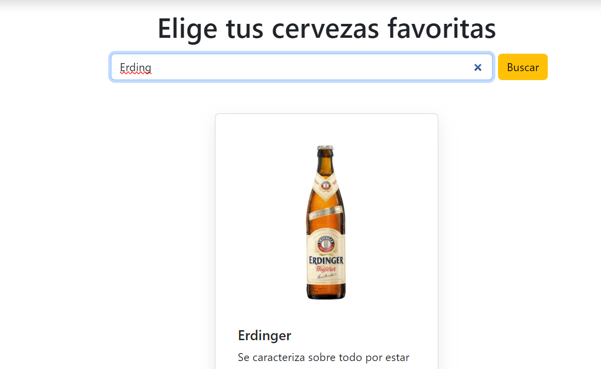
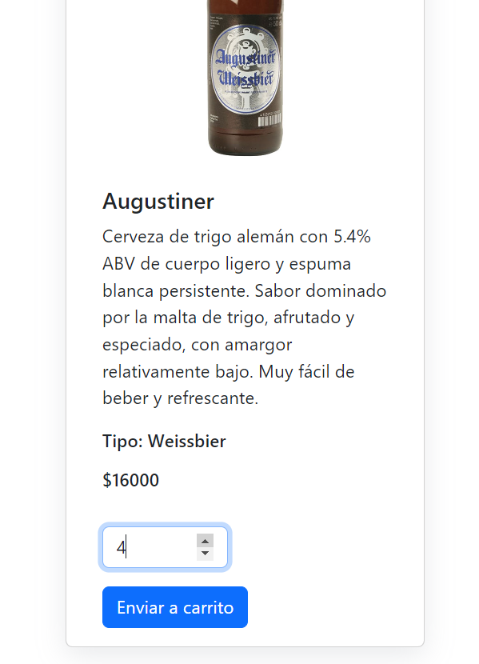
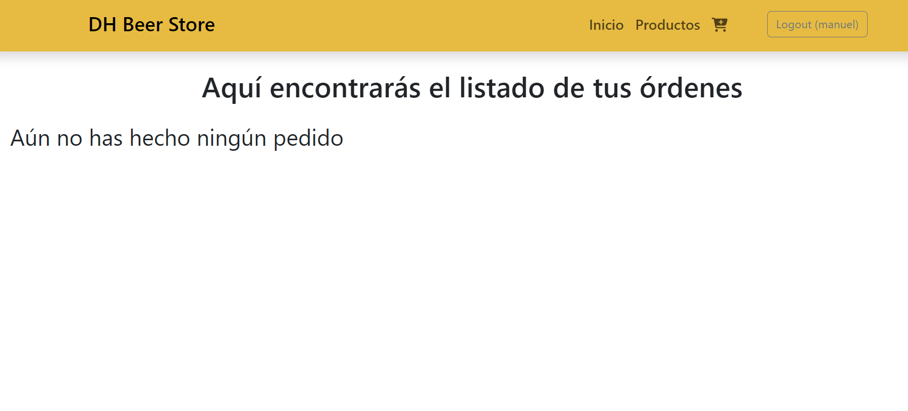
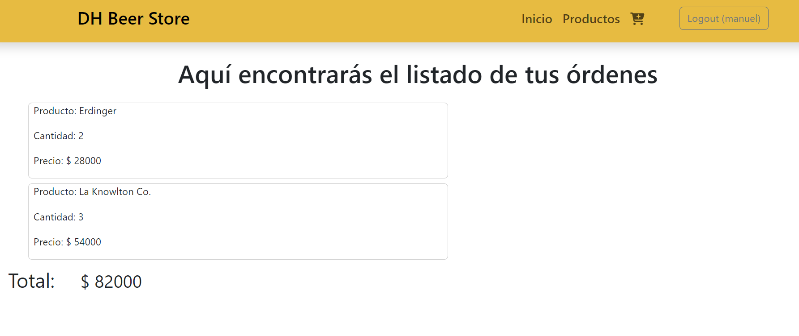

# Beer App: Aplicación Spring boot microservicios + React frontend.

Este proyecto de microservicios es un mvp de una tienda online de cervezas. Las cervezas pueden elegirse por categoría y marca. El usuario auntenticado puede realizar órdenes especificando la cantidad y acceder a su listado de órdenes y el total de su órden.

## Microservicios

* Product-service: Microservicio con arquitectura repository (model, dto, repository, service, controller) conectado a base de datos no relacional de mongo db.

* Inventory-service: Microservicio con arquitectura repository (model, dto, repository, service, controller) conectado a base de datos en MySQL. En esta base se almacena la información del código de inventario y unidades disponibles del producto.

* Order-service: Microservicio con arquitectura repository (model, dto, repository, service, controller) conectado a base de datos en MySQL. Se comunica con Inventory-service para verificar que el producto seleccionado tiene unidades disponibles, si las tiene realiza la orden, si no arroja error por insuficiencia de unidades.

* Api-Gateway: microservicio que permite centralizar el punto de entrada a las Api creadas en los microservicios mencionados y filtrar el acceso a través de un mecanismo de autenticación con jwt de Keycloak.

* Eureka-service: registra los moicro-servicios, permite a los microservicios registrarse y detectar otros servicios.

## Frontend

El frontend fue desarrollado con react, permite la búsqueda de productos por categoría, marca, seleccionar unidades deseadas y generar óredenes, previa autenticación, mediante registro y login a la página. Las órdenes requieren el login y las peticiones a order-service se realizan mediante token. 

